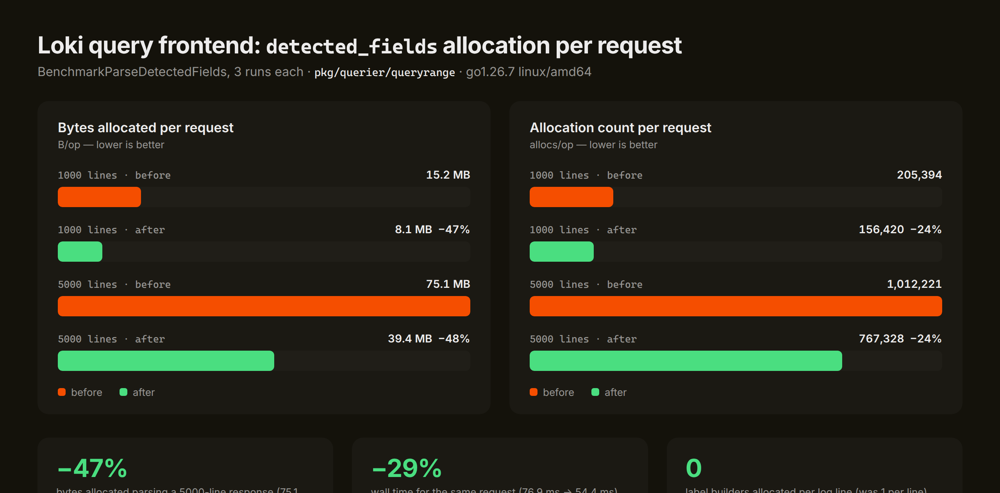
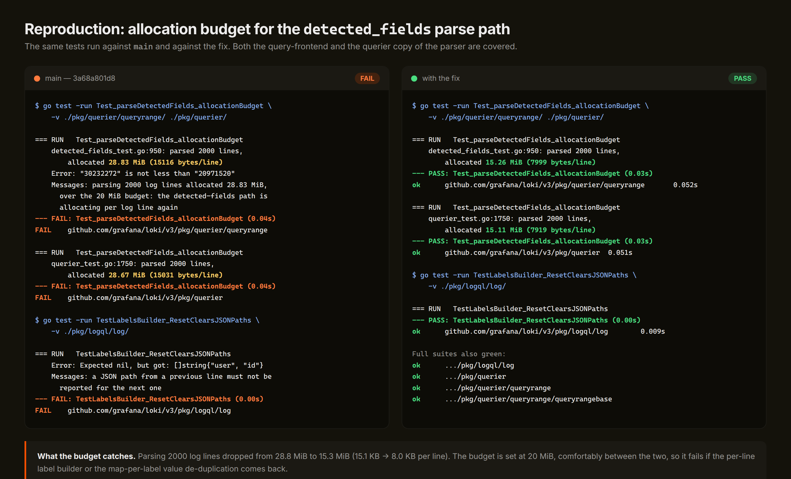
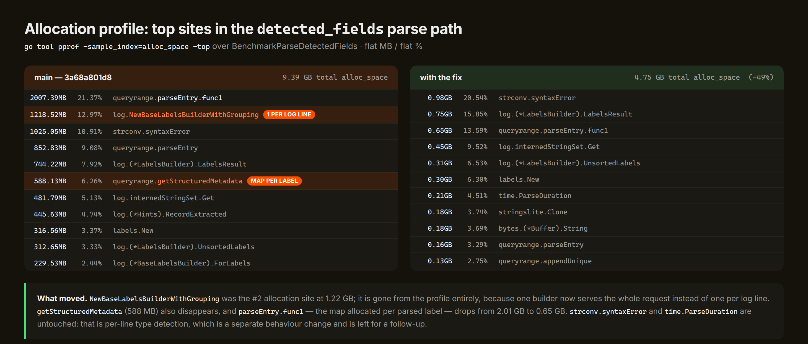

# Querier OOM: per-log-line allocation in the `detected_fields` path

Evidence for the fix on `cursor/loki-querier-oom-fix-5b71`.

## Symptom

Querier pods OOM-restarting after a rollout, with allocation spikes attributed to the query
frontend path.

## Root cause

`/detected_fields` is served by a query-frontend middleware
(`pkg/querier/queryrange/detected_fields.go`) that runs a log query downstream and then parses
**every line of the response**, up to the tenant's line limit (`max_entries_limit_per_query`,
5000 by default). `pkg/querier/querier.go` keeps a second copy of the same parser for the
ingester leg of the query.

For each log line, both copies did two expensive things:

1. **Built a fresh `logql/log.BaseLabelsBuilder`** — three 16-element label slices, a result cache
   map, a hasher, a JSON-path map — and re-hashed and re-rendered the stream's labels, even though
   the stream labels are identical for every line of a stream. The builder exists to be reused;
   `ForLabels` is documented as sharing its result cache across builders.
2. **Allocated a `map[string]struct{}` per label** to de-duplicate the one or two values a single
   line carries for that label, then converted every one of those maps back into a slice.

Together these dominated the profile. At the default line limit a single `/detected_fields`
request churned ~75 MB. Grafana Logs Drilldown polls the endpoint, so a handful of concurrent
requests is enough to drive the heap into the pod's limit and restart it.

## Fix

Three commits, all in the parse path:

- `fix(logql): Clear JSON paths when resetting a labels builder` — `SetJSONPath` records per-line
  parser output, but `Reset` did not clear it, so a reused builder could report a previous line's
  path. Clearing it in `Reset` is what makes sharing a builder across lines correct.
- `perf(querier): Stop allocating per log line in detected_fields` — one label builder per request,
  reset per line, with the stream hash computed once per stream; value de-duplication done in place
  with a linear scan instead of a map per label; the log line converted to bytes once instead of
  once per parser attempt.
- `perf(querier): Stop allocating per log line in the querier's detected_fields` — the same
  treatment for the querier's copy.

## Before / after

`BenchmarkParseDetectedFields`, 3 runs each, go1.26.7 linux/amd64:

| workload | B/op before | B/op after | Δ | allocs/op before | allocs/op after | Δ | ns/op before | ns/op after | Δ |
| --- | --- | --- | --- | --- | --- | --- | --- | --- | --- |
| 1 stream × 1000 lines | 15,189,959 | 8,083,276 | −46.8% | 205,394 | 156,420 | −23.8% | 17,944,098 | 11,665,763 | −35.0% |
| 10 streams × 100 lines | 15,074,164 | 7,962,568 | −47.2% | 202,545 | 153,586 | −24.2% | 17,813,266 | 11,168,538 | −37.3% |
| 50 streams × 100 lines | 75,081,484 | 39,411,728 | −47.5% | 1,012,221 | 767,328 | −24.2% | 76,933,760 | 54,428,238 | −29.3% |

Total `alloc_space` over the benchmark run fell from 9.39 GB to 4.75 GB (−49%).

## Reproduction

`Test_parseDetectedFields_allocationBudget` (added in both packages) parses 2000 lines and asserts
the allocation stays under a 20 MiB budget. It fails on `main` and passes with the fix:

## Where the allocations went

## Files

| file | what it is |
| --- | --- |
| `allocation_before_after.png` | benchmark comparison chart |
| `regression_test_before_after.png` | the new tests failing on `main`, passing with the fix |
| `pprof_top_before_after.png` | `pprof -top` allocation sites, before and after |
| `bench-before.txt` / `bench-after.txt` | raw `go test -bench` output |
| `pprof-alloc-before.txt` / `pprof-alloc-after.txt` | raw `pprof -top` output |
| `test-output-before.txt` / `test-output-after.txt` | raw `go test -v` output |

## Known remaining hotspots (not fixed here)

- `determineType` runs `strconv.ParseInt`/`ParseFloat`/`ParseBool`/`time.ParseDuration`/
  `humanize.ParseBytes` for every value of every field of every line, and the discarded parse
  errors are still ~20% of what is left. The code's own comment says it only wants to detect a
  type once per stream, but `detectType` is scoped inside the per-line loop, so it runs per line.
  Honouring the comment would change which line's type wins, so it belongs in its own change.
- `parseEntry` still allocates a fresh result map per log line. Removing it means changing the
  function to write into a caller-owned map or to yield per label.
